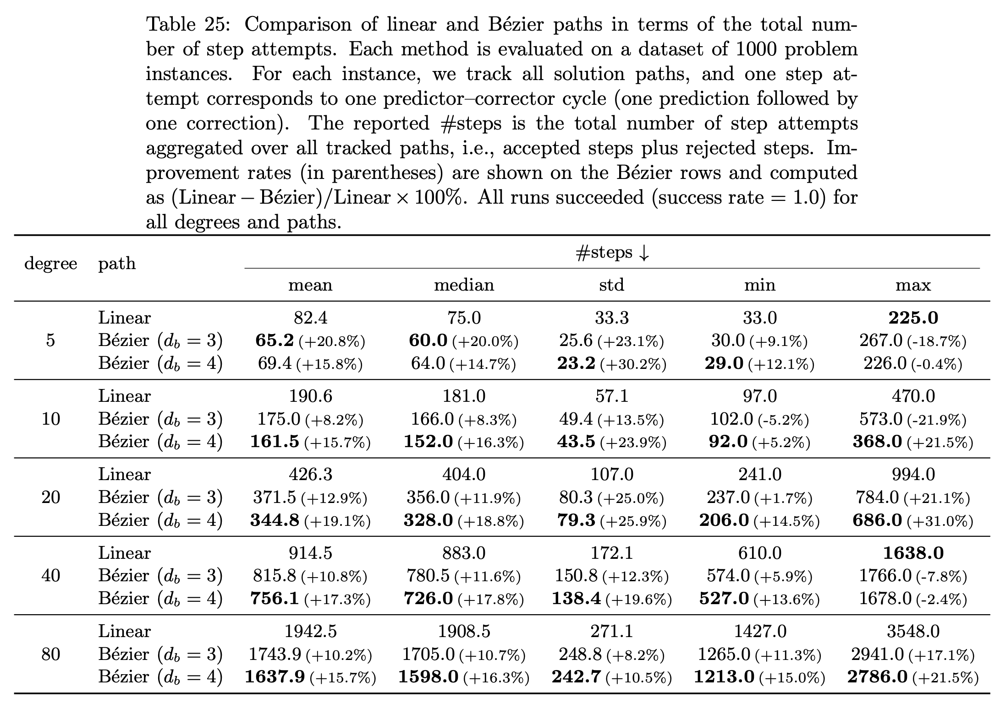

# PPO Learning for Univariate Bézier Homotopy Paths

---

## 1. Overview

- **Bézier curve** in coefficient space for homotopy continuation (univariate).
- **Optimize intermediate control points** via RL (PPO).
- **Goals:** ↑ success rate, ↓ step count (accepted / rejected), optionally ↓ compute time.
- **Evaluation:** compare Bézier path vs linear homotopy path (same problem, same tracker).

---

## 2. Problem Setting (Univariate Only)

- Univariate degree-$n$ polynomial with complex coefficients:
$$
f(x) = c_n x^n + c_{n-1} x^{n-1} + \cdots + c_0, \quad c_i \in \mathbb{C} \;\;(i = 0, \ldots, n)
$$
- **Start:** $g(x) = x^n - 1$ (total-degree) → $\mathbf{c}_g \in \mathbb{C}^{n+1}$.
- **Target $f$:** coefficients sampled per episode:
$$
\Re(c_i), \, \Im(c_i) \overset{\text{i.i.d.}}{\sim} \mathcal{U}[-b, b]
$$
- Bézier endpoints: $\mathbf{c}_g$ (start) and $\mathbf{c}_f$ (target).

---

## 3. Bézier Path and Control Points

- Degree $d \geq 2$ (e.g. 2, 3, 4); control points $P_0, \ldots, P_d \in \mathbb{C}^{n+1}$.
- Endpoints: $P_0 = \mathbf{c}_g$, $P_d = \mathbf{c}_f$.
- Bézier curve ($t \in [0,1]$):
$$
B(t) = \sum_{i=0}^{d} \binom{d}{i} t^i (1-t)^{d-i} \, P_i \in \mathbb{C}^{n+1}
$$
- **Optimize:** interior control points $P_1, \ldots, P_{d-1}$.
- **Initial control points:** $\bar{P}_k = (1 - k/d) P_0 + (k/d) P_d$; then $P_k = \bar{P}_k + \boldsymbol{\delta}_k$, $\boldsymbol{\delta}_k \in \mathbb{C}^{n+1}$.
- **Action:** $\mathbf{a} \in \mathbb{R}^{(d-1)m}$ (latent dim $m$); $\mathbf{a}$ determines $\boldsymbol{\delta}_1, \ldots, \boldsymbol{\delta}_{d-1}$.

---

## 4. Episode and Reward (One-Step)

- **Episode length:** $T=1$ (one action, one path evaluation).
- **State $\mathbf{s}$:** $\mathbf{s} = (\mathbf{c}_f, \mathbf{c}_g)$.
- **Action $\mathbf{a}$:** $\mathbf{a} = (\mathbf{a}_1, \ldots, \mathbf{a}_{d-1})$, $\mathbf{a}_k \in \mathbb{R}^m$; $\boldsymbol{\delta}_k = \Phi(\mathbf{a}_k)$ via fixed $\Phi : \mathbb{R}^m \to \mathbb{C}^{n+1}$; entries clipped (e.g. $[-1,1]$).
- **Reward $r$ (terminal only):**
  - Tracker run → accepted $N_{\text{acc}}$, rejected $N_{\text{rej}}$; cost: success $J = N_{\text{acc}} + \rho N_{\text{rej}}$, failure $J = M$.
  - Baseline: $J_{\text{linear}}$ = cost for linear homotopy path (same tracker).
  - $r = c_{\text{linear}} \cdot (J_{\text{linear}} - J)$; lower $J$ with Bézier than linear → positive reward.

---

## 5. Learning Method

- **Algorithm:** PPO (Proximal Policy Optimization), continuous action space.
- Custom RL environment; observations = target/start coefficients + progress info.
- **Parameters:** $n$, $d$, $m$, reward coefficients, tracker params, etc., set per experiment.

---

## 6. Experimental Setup

- Degree $n \in \{5, 10, 20, 40, 80\}$, Bézier degree $d \in \{3, 4\}$, $T=1$.
- Reward: $c_{\text{linear}}=10$, $\rho=1$, failure penalty $M$.
- Tracker step params ($\alpha$, $\beta_{\omega_p}$, $\beta_\tau$, strict $\beta_\tau$, …) from prior work.
- PPO: total steps, rollout length, LR, $\gamma$, GAE $\lambda$ in standard ranges.
- **Eval:** fixed validation instances; compare vs linear path and zero-perturbation Bézier.

---

## 7. Results

An example of training and evaluation is shown in the figure below.

    

- **Success rate:** 1.0 for all conditions → comparison is **efficiency (\#steps)**.
- **Overall:** Bézier reduces \#steps for many degrees; **$d_b=4$** consistently best.
- **Mean/median:** $d_b=4$ minimal at degree 10, 20, 40, 80 → **~15–19%** reduction vs linear.
- **Stability (std):** $d_b=4$ minimizes std for many degrees.
- **Worst case (max):** $d_b=4$ best at degree 10, 20, 80; linear best at degree 5, 40 (curve can slightly worsen worst instances).
- **$d_b=3$:** mean/median improve but max worsens at some degrees (“good on average, prone to outliers”).
- **Conclusion:** recommend **$d_b=4$** by default (stable improvement at high degree).
